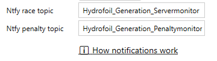
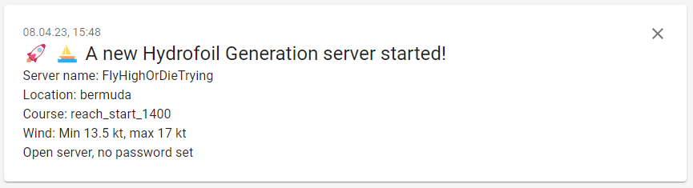
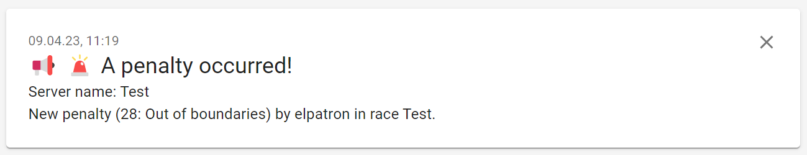
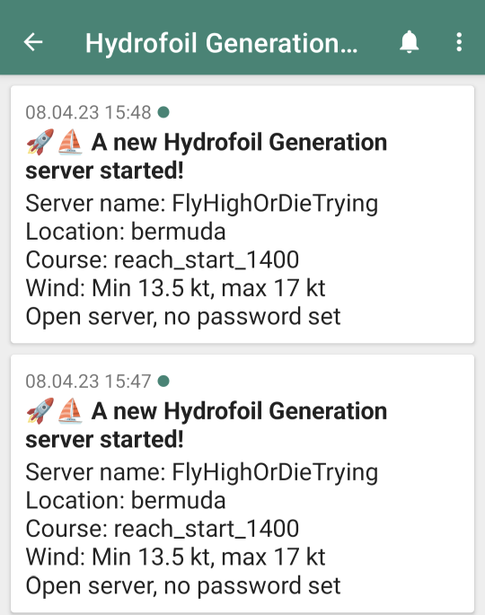

# HG Server-Manager

*HG Server Manager* is a .NET Windows application that eases the management of the [Hydrofoil Generation](https://store.steampowered.com/app/1448820/Hydrofoil_Generation/) game server.

## Features

- 🦋 Clean and beautiful user interface
- ⚙️ All server parameters editable 
- 🛠️ Control your server:
  - 🚀 Start/stop game server
  - ⚠️ Get notified of the occurrence of penalties
  - 👨‍👩‍👧‍👦 See if your server is publicly reachable
- 📬 Notify players of your server launches
- ♾️ Load and save an unlimited number of different configurations
- ⛵ Instantly switch between up to 10 user-defined presets by hot key
- 📃 Open game server log file and *snaps* directory directly from the application

## Installation

- Download latest release from https://github.com/elpatron68/HG-Server-Manager/releases (zip file)
- Extract the archive to a directory of your choice
- Start `HG-ServerUI.exe`

## Usage

*HG-Server-Manager* loads the active server configuration from the file `server_cfg.kl` at startup. You can modify the configuration according to your requirements. All settings are saved at the moment you click the *Start Server* button.

### Load an existing configuration from a file

Load an existing configuration from a file by opening the Menu *File* and selecting *Load configuration*.

### Save configuration to a file

You can save a configuration for later use by opening the Menu *File* and selecting *Save configuration as*.

### Save configuration without starting the server

Open *File* - *Save current configuration* saves the configuration to the default file `server_cfg.kl` without starting the server.

### Manually edit configuration

Open *File* - *Manually edit configuration* to edit `server_cfg.kl` in the *Notepad* text editor. Changes to the file will be loaded to the user interface after saving the file.

### Open server log

You can open the server log `log.log` in the *Notepad* text editor by opening *File* - *Open server log*.

### Ntfy

The menu *Ntfy* lets you open the Ntfy game- and penalty topics in your web browser. For details, see section about *Ntfy* section below.

### Snaps

The menu *Snaps* - *Open snaps* opens an Windows *Explorer* window in your *snaps* directory. You can delete all snap files by selecting *Snaps* - *Delete all files in snaps directory*.

### Status bar

The status bar at the bottom of the window shows informations about the state of your server.

After launching a server process, *HG Server-Manager* tries to connect to the specified *TCP* Port via your **external** IP-address to determine if you are able to host a public race (marked green). If the value is *true*, you probably have set up your port forwardings correctly. If it´s *false*, you host a *LAN* game, not visible to the public.

### Protocol

The protocol text box informs you about events and problems. Have a look at it if something does not work as expected.

### Penalties

Occurring penalties are displayed in the *Penalties* text box. New penalties are signalized with a sound effect.

### Hot slots

*HG Server-Manager* supports up to ten *hot slots* to quickly change between different configurations. Every *hot slot* represents a different server configuration.

#### Activate a hot slot

The keyboard hot keys `Crtl+1` to  `Crtl+0` activate a corresponding *hot slot*. The game server will immediately launch. **A previously started server is terminated beforehand.**

#### Assigning a configuration to a hot slot

- Load (or edit) a configuration and adjust it to your needs.
- Save this configuration with the file name `slot<Number>.kl`. E.g. for `Crtl+3` the file name should be `slot3>.kl`.

## How notifications work

There are two use cases for notifications:

- You want to inform your player community about your game server launces.
- You (or your players) want to be informed if your game server detects any penalties.

**Let your players never miss one of your races by letting them subscribe to your messages!**

*HG Server-Manager* uses the free service [*Ntfy*](https://ntfy.sh/) to send notifications to subscribed clients. To setup *Ntfy* notifications as game host, you have to

- Select a *topic* for race notices and enter it in the corresponding field
- Select a *topic* for penalty notices and enter it in the corresponding field

A Ntfy *topic* is sort of a channel, users can subscribe to. You can enter any alphanumeric topic name you want. But be aware of the fact, that every topic is public and everyone can read the messages if the name of the topic is known. So, if you want to have some privacy, give your topic(s) a random alpha-numeric name like `qPd5AbhVfwv5FJFQtYRY4xCf`.

 

Example notification (web browser)

Example notifications (Android app)

As player, who wants to be informed about starting races of their favorite host, you can subscribe the Ntfy topic: Ask the game host for the topic(s) to subscribe to (if the default values were changed).

- Open the web site `https://ntfy.sh/<topic>` in your browser or
- install the [Ntfy app](https://ntfy.sh/#subscribe-phone) on your mobile and add to the *topic*.

If you have not configured own *topics*, *HG Server-Manager* sends notifications to the *topics* [`Hydrofoil_Generation_Servermonitor`](https://ntfy.sh/Hydrofoil_Generation_Servermonitor) (game server start events) and [`Hydrofoil_Generation_Penaltymonitor`](https://ntfy.sh/Hydrofoil_Generation_Penaltymonitor). Click on the links to open the default topics in your web browser.

> Tip: If you use own topics, inform your player community about them.

> Tip: Ntfy topics are saved to the game server configuration file(s), so you can use different topics in different server configurations.

### Disable Ntfy notifications

Leave one or both *topic* fields empty to disable Ntfy notifications.