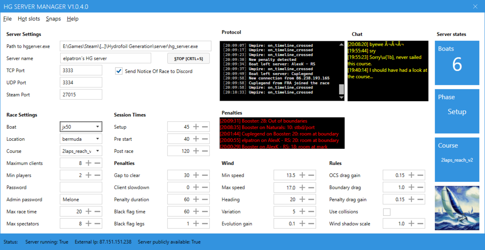
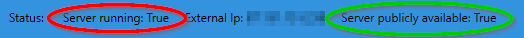
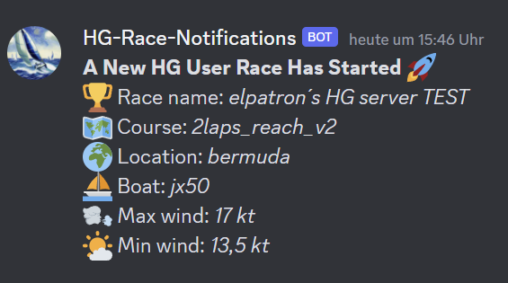

# HG Server-Manager

*HG Server Manager* is a .NET Windows application that eases the management of the [Hydrofoil Generation](https://store.steampowered.com/app/1448820/Hydrofoil_Generation/) game server.

## Features

- 🦋 Clean and beautiful user interface
- :mage: Zero configuration: Download and run the app, everything is detected „automagically“
- ⚙️ All server parameters editable 
- 🛠️ Control your server:
  - 🚀 Start/stop game server
  - ⚠️ Get notified of the occurrence of penalties
  - 👨‍👩‍👧‍👦 See if your server is publicly reachable
  - :speech_balloon: Follow the in game chat from the user interface
- 📬 Notify players of your server launches via *Discord*
- ♾️ Load and save an unlimited number of different configurations
- ⛵ Instantly switch between up to 10 user-defined presets by hot key
- 📃 Open game server log file and `snaps` directory directly from the application
- :checkered_flag: View regatta results and series points in formatted tables and send them to discord
- :broom: Clean up  `races` directory and start a new series (to be exactly: *archive all files to a zip file*)

## Installation

- Download the file `HG_Server-Manager.zip` from [latest releases](https://github.com/elpatron68/HG-Server-Manager/releases/latest)
- Extract the archive to a directory of your choice
- Start `HG-ServerUI.exe`

## Usage

*HG-Server-Manager* loads the active server configuration from the file `server_cfg.kl` at startup. You can modify the configuration according to your requirements. All settings are saved at the moment you click the *Start Server* button.

### Load an existing configuration from a file

Load an existing configuration from a file by opening the Menu *File* and selecting *Load configuration*.

### Save configuration to a file

You can save a configuration for later use by opening the Menu *File* and selecting *Save configuration as*.

### Save configuration without starting the server

Open *File* - *Save current configuration* saves the configuration to the default file `server_cfg.kl` without starting the server.

### Manually edit configuration

Open *File* - *Manually edit configuration* to edit `server_cfg.kl` in the *Notepad* text editor. Changes to the file will be loaded to the user interface after saving the file.

### Open Server Log

You can open the server log `log.log` in the *Notepad* text editor by opening *File* - *Open server log*.

### Snaps

The menu *Regattas* - *Snaps* - *Open snaps* opens an Windows *Explorer* window in your *snaps* directory. You can delete all snap files by selecting *Regattas* - *Snaps* - *Delete all files in snaps directory*.

### View results

View the results of all your regattas by selecting *Regattas* - *View results*:

The view starts with cumulated values from all boats in all races. Select a result file name to be displayed in the *ComboBox* at the top to display a concrete result:

### Archive Results

Select *Regattas* - *Start new regatta series* to move all files of your server´s `results` Directory to a Zip file. The Zip file will be stored in the subdirectory `archive` of the directory, where *HG Server* is located. You can restore it by extracting the contents of a Zip archive file to it´s original directory. Afterwards, all boats and points are reset for a new series of races.

### Status Bar

The status bar at the bottom of the window shows informations about the state of your server.

After launching a server process, *HG Server-Manager* tries to connect to the specified *TCP* Port via your **external** IP-address to determine if you are able to host a public race (marked green). If the value is *true*, you probably have set up your port forwardings correctly. If it´s *false*, you host a *LAN* game, not visible to the public. Note, that the result is updated as soon as the server process is launched. So after starting *HG Server-Manager*, it´s always `False`.

### Protocol

The protocol text box informs you about events and problems. Have a look at it if something does not work as expected.

### Penalties

Occurring penalties are displayed in the *Penalties* text box. New penalties are signalized with a sound effect.

### Hot Slots

*HG Server-Manager* supports up to ten *hot slots* to quickly change between different configurations. Every *hot slot* represents a different server configuration.

#### Activate a hot slot

The keyboard hot keys `Crtl+1` to  `Crtl+0` activate a corresponding *hot slot*. The game server will immediately launch. **A previously started server is terminated beforehand.**

#### Assigning a configuration to a hot slot

- Load (or edit) a configuration and adjust it to your needs.
- Save this configuration with the file name `slot<Number>.kl`. E.g. for `Crtl+3` the file name should be `slot3>.kl`.

### Discord announcements

*HG Server-Manager* can announce the start of your server by Discord message. Check the corresponding *Switch* to enable Discord messages. The messages are sent to the channel `#hydrofoil-gerneration-race-annoncements` on the author´s server. You can follow the channel to add the messages to your own server by clicking this [link](https://discord.gg/6VbyhrZ9UG) and selecting *Follow*.

### Start Server

Click on the button *Start [Crtl+s]* or use the hotkey `Crtl+s`to start the server process. The game server process `hg_server.exe` will be launched and after that, *HG Server-Manager* tries to establish a TCP connection to the game server´s *TCP Port* to determine, if your server is publicly reachable. The result of this check is shown in the *Status Bar*. Note: If this check fails, no Discord message will be sent, even if the option is activated!